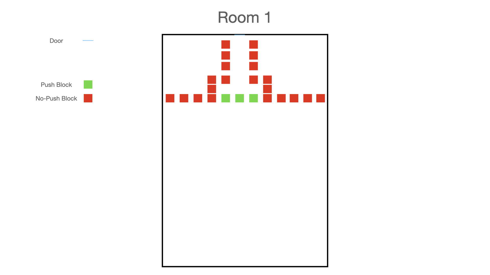
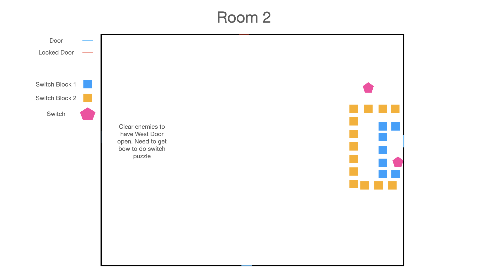
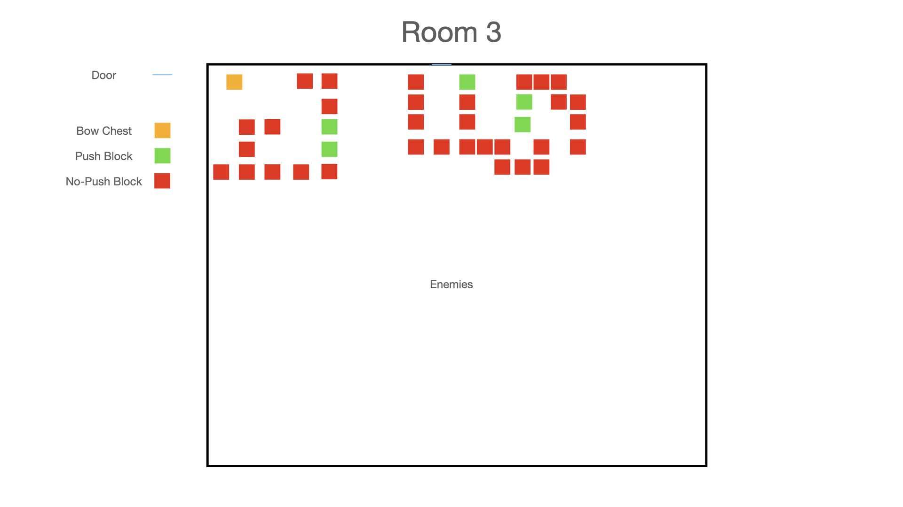
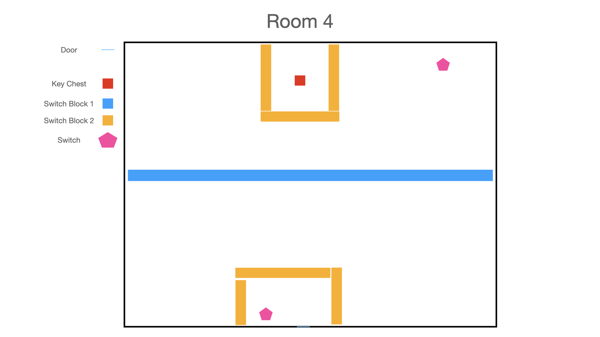
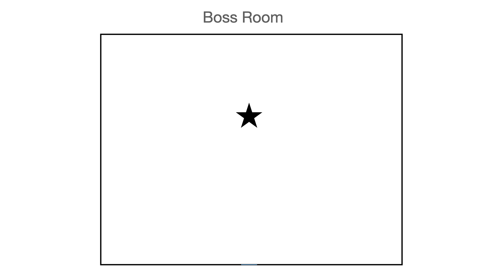

# SEI Capstone Project Proposal

## Project Idea

Working title: The Legend of Python. My goal with this project is exploring pygame and by creating a _Legend of Zelda_ clone. To limit scope, I would implement the first dungeon and move on from there.

## User Story

This game is for all the people who grew up on old-school games. I'm specifically looking to imitate the GameBoy Color versions of _The Legend of Zelda_. These are top-down with pretty simple graphics and not a lot of bloated complexity to get in the way of the core concept of the game.

These users are looking for a slice of nostalgia and want to experience that again.

---

## Player Character

### Player Input

To start with, I would focus on keyboard controls, and as a post-mvp add controller support.

| Action                 | KeyBind     |
| ---------------------- | ----------- |
| Move Up                | Up Arrow    |
| Move Left              | Left Arrow  |
| Move Right             | Right Arrow |
| Move Left              | Left Arrow  |
| Swing Weapon / Confirm | Z           |
| Use Special Item       | X           |
| Open Menu              | Esc         |

Combining the arrows will allow you to move diagonally (sprite will face up or down if that movement is occuring)

## Player Items

MVP, the player character will find one special item in the dungeon (I'm leaning towards bow and arrow). With further iterations, the player would be able to go into their menu to change their special item to help with solving puzzles and combat.

---

## Enemies

For the first dungeon (MVP), there will be two basic enemy types.

- Bats that slowly fly towards and damage you if they touch you
- Skeletons that jump at you and damage you if they touch you

The final room in the dungeon, for a post-MVP goal, would be a boss fight. I'm considering a static column (for lack of a better word) that has a flame attack that you have to run from. After it's done spraying flames, it becomes vulnerable to an arrow shot.

## Other Assets

- Chest with keys or bow
- Doors that open depending on puzzle, enemies cleared, or key
- Push Blocks
- Non-Pushable Block
- Switch Block 1
- Switch Block 2
- Switch

---

## Dungeon

The main focus of puzzles will be pushblocks and switched barriers. Enemies will respawn if you exit the room and re-enter. Pushblocks and switched blocks will also go to default.

On game load, the player starts in Room 1 and continues to the boss room to complete the dungeon.

---

## Visuals

Since I'm not a visual artist, I will utilize free assets from the web. I've found a couple different websites with this kind of content.

Potential Examples:

- [Dungeon Tileset 1](https://opengameart.org/content/dungeon-tileset)
- [Dungeon Tileset 2](https://opengameart.org/content/a-blocky-dungeon)

- [Slime Monster](https://opengameart.org/content/slime-monster-24x24)

## Sound and Music

I'll find some quick effects and music for testing purposes, but as a post-mvp would love to do the sound design and composition myself

---

## MVP

| Step                                          | Time Estimation |
| --------------------------------------------- | --------------- |
| Base Setup of Game                            | 4 Hours         |
| Build Room 1 (no puzzles to start)            | 2 Hours         |
| Create Character                              | 6 Hours         |
| Create Enemies                                | 5 Hours         |
| Create Dungeon Assets (keys, push-blocks etc) | 5 Hours         |
| Create Menu                                   | 4 Hours         |
| Complete Room 1                               | 3 Hours         |
| Build Room 2                                  | 3 Hours         |
| Build Hallways                                | 2 Hours         |
| Build Room 3                                  | 3 Hours         |
| Build Room 4                                  | 3 Hours         |
| Build Boss Room                               | 2 Hours         |

Total Time Approximation for MVP: 42 Hours

## Post MVP

- Custom sound design and music
- Boss Fight

---

## Deployment

Initially, I'll have instructions in the readme for installation of pygame and then direct users on how to initiate the game through the terminal. Ultimately, I would like to host this potentially on Steam or some other platform of that nature. I'm not sure what that process is, but I'll be researching it over the weekend (as well as doing multiple pygame tutorials!)